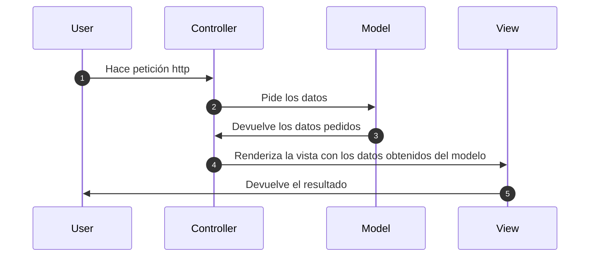
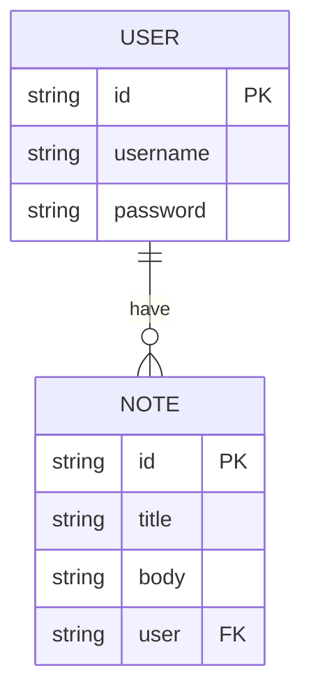

# Aplicación simple de notas hecha con Express js y Handlebars.

## Iniciar aplicación
### Variables de entorno
```
PORT= Puerto de escucha de express
MONGODB_URI= URI para conexión con MongoDB
SECRET= Clave secreta para cifrar las sesiones
```

### Uso
```bash
$ npm run install
```
```bash
$ npm start
```

### Uso en desarrollo
```bash
$ npm run dev
```

## Iniciar con Docker
### Uso con docker-composer

Generar imagen de la aplicación
```bash
$ docker-compose build
```

Iniciar contenedor en segundo plano
```bash
$ docker-compose up -d
```

### Comprobar los logs del contenedor

Logs de la aplicación express-notes-app
```bash
$ docker-compose logs express-notes-app
```

Logs de la base de datos
```bash
$ docker-compose logs db
```
### Cómo funciona Modelo-Vista-Controlador


### Equivalencia de la BBDD a relacional
